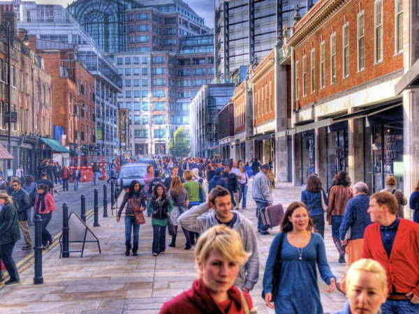
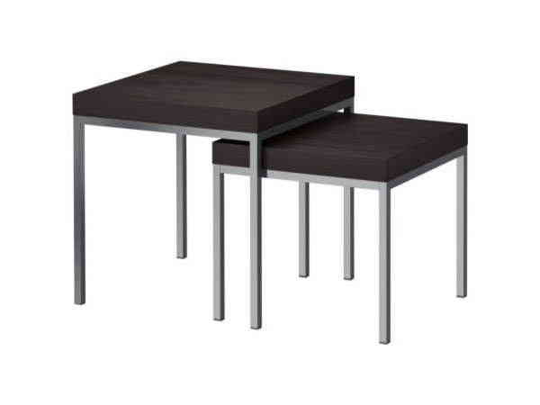

The HTML Structure
For the HTML structure we will have a main container and each image inside of a div with the class “zt-item”:

	

		
		

		

	

	

		
		

	
		
	

		
		

	
			

 is the image in each step. The item then have tags with certain attributes.
The data attributes are the following:

data-dir is either 1 or -1 depending on whether we want to “zoom in” (1) or “zoom back out” (-1)
data-link will indicate to which item we connect the tag to (based on the data-id we give to each item)
data-zoom is the factor of zooming. Set very low, the image we zoom into or zoom back to will only enlarge slightly.
data-speed the animation speed in milliseconds
data-delay the delay time for the new image to appear
The example structure above has the first initial image (zt-item-1) with two tags that lead to zt-item-2 and zt-item-3. zt-item-2 and zt-item-3 only have the back tag. As you can see, the back tag has another class “zt-tag-back” and a data-dir value of -1.

The position of the tags is defined in the style attribute and you can also add another size for it, too.

Options
The following are the default options:

$('#zt-container').zoomtour({
	// if true the tags are rotated depending on their position
	rotation		: true,
	// zoom out animation easing. Example: easeOutBounce , easeOutBack	
	zoominEasing	: '',  
	// zoom out animation easing
	zoomoutEasing	: ''	
});
We hope you like this little script and find it useful!